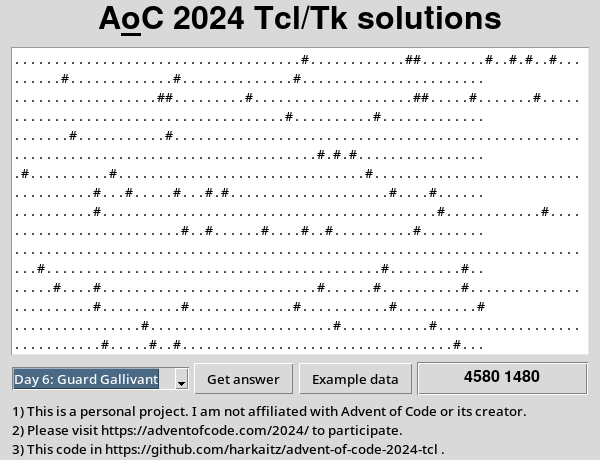

ADVENT OF CODE - 2024 - IN TCL
==============================

This project is a collection of solutions to the [Advent of Code 2024](https://adventofcode.com/2024)
problems, implemented in Tcl.

 
  
 Adoration of the Magi by Antonio Allegri da Correggio 1489 - 1534

Full List:

- Day 1: Historian Hysteria: [01.tcl](./01.tcl), [enunciation](https://adventofcode.com/2024/day/1). 
- Day 2: Red-Nosed Reports: [02.tcl](./02.tcl), [enunciation](https://adventofcode.com/2024/day/2).
- Day 3: Mull It Over: [03.tcl](./03.tcl), [enunciation](https://adventofcode.com/2024/day/3).
- Day 4: Ceres Search: [04.tcl](./04.tcl), [enunciation](https://adventofcode.com/2024/day/4).
- Day 5: Print Queue: [05.tcl](./05.tcl), [enunciation](https://adventofcode.com/2024/day/5).
- Day 6: Guard Gallivant: [06.tcl](./06.tcl), [enunciation](https://adventofcode.com/2024/day/6).
- Day 7: Bridge Repair: [07.tcl](./07.tcl), [enunciation](https://adventofcode.com/2024/day/7).
- Day 8: Resonant Collinearity: [08.tcl](./08.tcl), [enunciation](https://adventofcode.com/2024/day/8).
- Day 9: Disk Fragmenter: [09.tcl](./09.tcl), [enunciation](https://adventofcode.com/2024/day/9).
- Day 10: Hoof It: [10.tcl](./10.tcl), [enunciation](https://adventofcode.com/2024/day/10).
- Day 11: Plutonian Pebbles: [11.tcl](./11.tcl), [enunciation](https://adventofcode.com/2024/day/11).
- Day 12: Garden Groups: [12.tcl](./12.tcl), [enunciation](https://adventofcode.com/2024/day/12).
- Day 13: Claw Contraption: [13.tcl](./13.tcl), [enunciation](https://adventofcode.com/2024/day/13).
- Day 14: Restroom Redoubt: [14.tcl](./14.tcl), [enunciation](https://adventofcode.com/2024/day/14).
- Day 15: Warehouse Woes: [15.tcl](./15.tcl), [enunciation](https://adventofcode.com/2024/day/15).
- Day 16: Reindeer Maze: [16.tcl](./16.tcl), [enunciation](https://adventofcode.com/2024/day/16).
- Day 17: Chronospatial Computer: [17.tcl](./17.tcl), [enunciation](https://adventofcode.com/2024/day/17).

Install tcl `sudo apt-get -y install tcl tk` and then run with `tclsh ./01.tcl`. You
can also run the [gui](./aoc2024.tcl) with `wish ./aoc2024.tcl` 😉.

## Screenshots:

